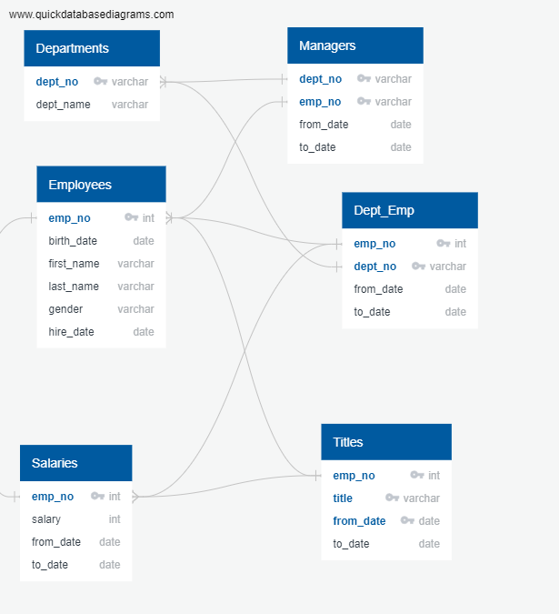
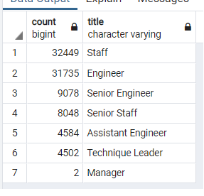
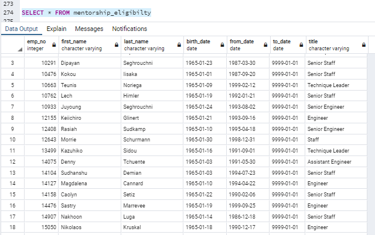
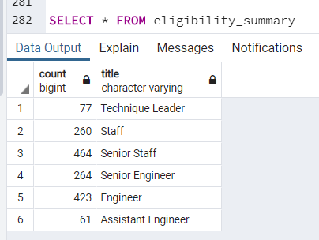
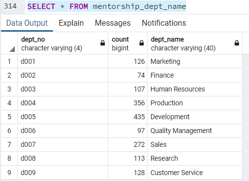

# Pewlett-Hackard-Analysis

# Overview of the analysis: 

The purpose for this analysis is to search through an employee database to figure out which employees will retire this year. I used PostgreSQL and created csv files in order to determine which employees would retire. Also in order to create an ERD to help with the process, I used QuickDBD (ERD code found in Class Notes file). 



# Results: 

## Deliverable 1

I was able to determine which employee roles that had the most amount of employees retiring. It looks like the top three roles from highest to lowest is:
1. Staff at 32,449 employees
2. Engineers at 31,735 employees
3. Senior Engineers at 9,078 employees

The role with the least amount of employees retiring is Managers with only 2 managers retiring. 

**Here is a photo of the output:



## Deliverable 2

The employer decided that there will be a mentorship program offered to those who are about to retire to mentor new-hires. This program is offered to those born on 1965. I was able to find which employees were eligible and their titles.

**Here is an snippet of part of my table of the results



# Summary: 

There is 90,398 employees that are projected to retire from the company. If you assume that 100% of those who are eligible will take the oportunity, there are 1,549 employees who could accept being part of this program.



- Are there enough qualified, retirement-ready employees in the departments to mentor the next generation of Pewlett Hackard employees?
Based on the percentage alone, there doesn't seem to be enough retiring employees that are capable of mentoring the next generation. 

I did a query to see how many eligible mentors are in each department:

```
-- High Level summary:
SELECT COUNT(title), title
INTO eligibility_summary
FROM mentorship_eligibilty
GROUP BY title
ORDER BY title DESC;

SELECT * FROM eligibility_summary

SELECT 
mentorship_eligibilty.title,
dept_employee.dept_no,
dept_employee.emp_no
INTO mentorship_departments
FROM mentorship_eligibilty
INNER JOIN dept_employee
ON (mentorship_eligibilty.emp_no = dept_employee.emp_no);

SELECT * FROM mentorship_departments

SELECT COUNT(dept_no), dept_no
INTO mentorship_dept_group
FROM mentorship_departments
GROUP BY dept_no
ORDER BY dept_no;

SELECT * FROM mentorship_dept_group

SELECT 
mentorship_dept_group.dept_no,
mentorship_dept_group.count,
departments.dept_name
INTO mentorship_dept_name
FROM mentorship_dept_group
INNER JOIN departments
ON (mentorship_dept_group.dept_no = departments.dept_no)
ORDER BY dept_no;

SELECT * FROM mentorship_dept_name
```

**This was the result that I got:



Based on this query, based on the sheer number of employees, there isn't enough mentors to distribute throughout each department. 
